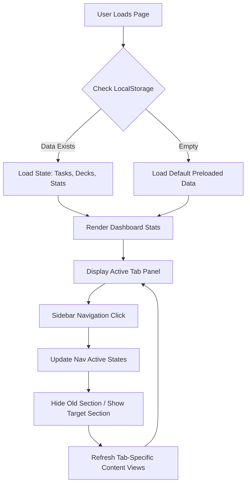
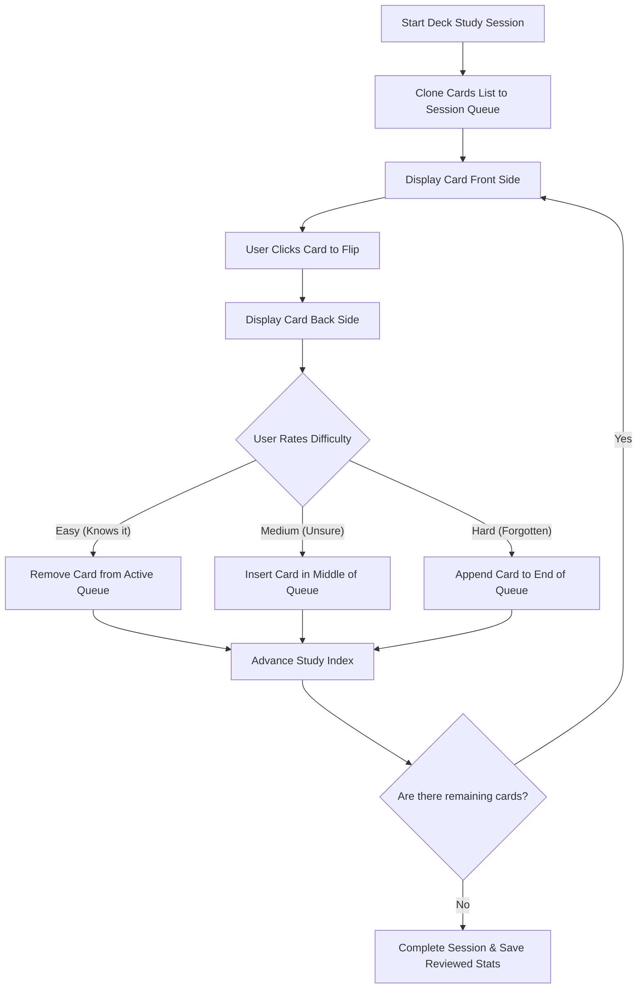
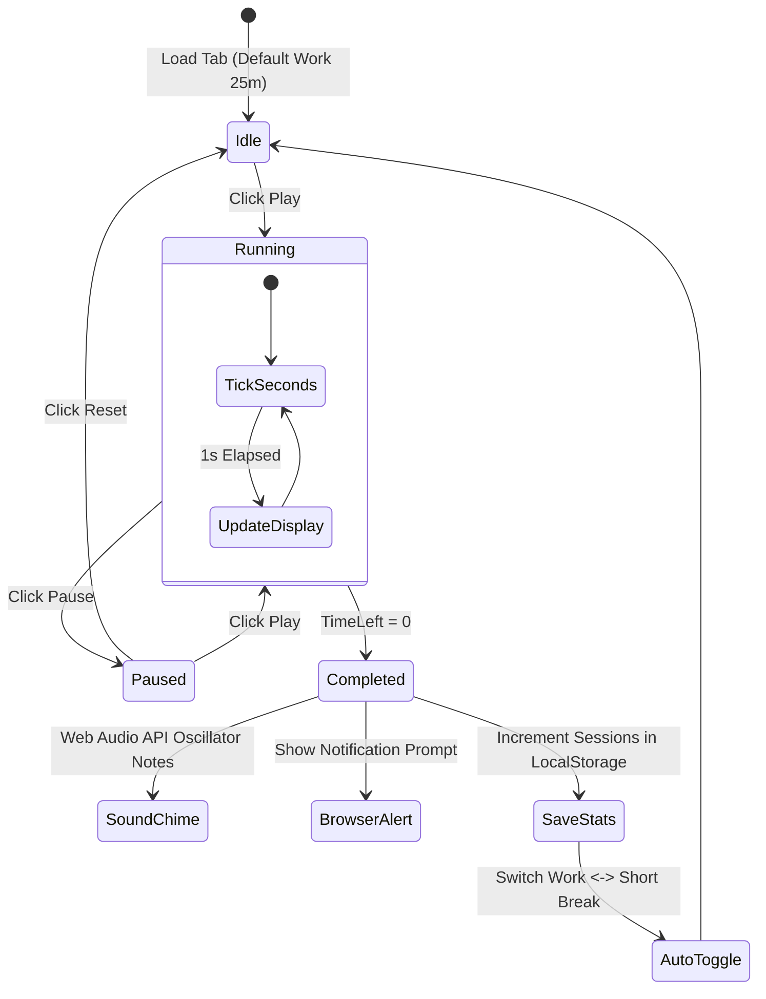
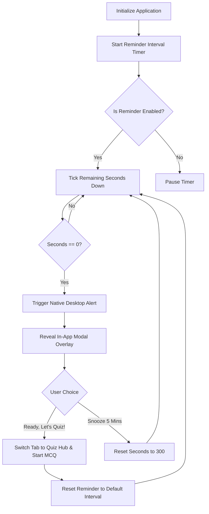

# StudyMentor (Aether Study Suite)

StudyMentor (Aether Study Suite) is a premium, high-fidelity single-page productivity suite designed to optimize study habits. It integrates essential learning tools—**Task Planner**, **Pomodoro Timer**, **Spaced Repetition Flashcards**, and an **Interactive Quiz Maker with Reminders**—into a unified, glassmorphic dashboard.

All user data (tasks, pomodoro metrics, custom flashcard decks, quiz score history) is persisted locally in the browser using the `localStorage` API. No server-side setup or database credentials are required.

---

## ⚡ Key Features

1. **Integrated Dashboard**: Centralized hub showing today's focal tasks, Pomodoro completion metrics, flashcard review statistics, and overall quiz accuracy.
2. **Weekly Study Streak Heatmap**: 7-day visual bar chart displaying Pomodoro completion frequency with consecutive day streak counting.
3. **Daily Pomodoro Goal**: Live progress bar tracking progress toward a configurable target (default: 4 sessions per day).
4. **Tasks Planner (Todo)**: Priority-tagged (`High`, `Medium`, `Low`) task builder sorted by status, complete with due dates, custom subject categories, overdue notification badges, and completion indicators.
5. **Focus Pomodoro Timer**: 25-minute focus blocks, 5-minute short breaks, and 15-minute long breaks. Displays a circular glowing SVG progress bar, desktop alerts, background ticking, and audio chimes.
6. **Spaced Repetition Flashcards**: Leitner-style study engine that dynamically reschedules cards into the active queue based on user feedback (`Easy`, `Medium`, `Hard`) with 3D flip card animations.
7. **Interactive Quiz Hub**: Custom multiple-choice question builder with instant color-coded correct/incorrect feedback and automatic grading history.
8. **Quiz Reminders**: Scheduled study check-ins that trigger warning dialogs (and native desktop alerts) to test retention during study sessions.
9. **Keyboard Shortcuts & Toasts**: Express navigation controls (`D`, `T`, `F`, `Q` tabs; `P`/`R` timer controls; `Space` & `1`/`2`/`3` flashcard actions) accompanied by interactive bottom toast notification confirmations.
10. **Responsive Design**: Collapsible sidebar navigation (hamburger menu style) and fully responsive layouts optimized for desktops, tablets, and mobile devices.

---

## 🗺️ System Workflows & Flowcharts

The following diagrams illustrate how the SPA manages its routers, state data, and intervals.

### 1. SPA Routing & State Management Workflow
This diagram shows how `app.js` manages client-side routing, view transitions, and pulls persistent state from local storage.



### 2. Spaced Repetition System (SRS) Card Lifecycle
How flashcard queues are rescheduled during active study sessions based on card ratings:



### 3. Pomodoro Timer Lifecycle
Details how focus and break intervals count down, play audio notifications, and interface with the browser:



### 4. Quiz Study Reminder Interval Workflow
The scheduled system triggers periodic active recall checks during study periods:



---

## 📘 Detailed User Guide

### 📂 Tasks Planner (Todo)
* **Creating Tasks**: Enter a descriptive title, choose a Priority status (High/Medium/Low), assign a subject label (e.g. "Biology", "Math"), and select a due date.
* **Managing Tasks**: Check the custom box on any card to mark it as complete. The progress indicator at the top right of the board automatically updates to show completion percentages. Click the trash icon to permanently remove a task.
* **Previews**: High priority and active pending tasks automatically mirror on the **Dashboard** under *Today's Focus Tasks* to keep you focused.

### ⏱️ Focus Pomodoro Timer
* **Starting Sessions**: Choose your mode from the toggle pill at the top: *Pomodoro* (25 min), *Short Break* (5 min), or *Long Break* (15 min). Press the large central play button to start/pause.
* **Audio settings**: Enable the **background ticking sound** checkmark to help you focus. You can toggle the alarm audio mute button (the speaker icon) at any time.
* **Desktop Notifications**: Grant browser notification permissions to receive popup windows when a focus or break period expires.

### 🃏 Spaced Repetition Flashcards
* **Creating Decks**: Click the `+` button in the decks sidebar, type in a subject name, and click Create.
* **Adding Cards**: Select your deck and click **Manage**. Enter a term/question on the Front, a definition/answer on the Back, and click Add.
* **Studying**: Click **Study** on any deck. Click the large card to flip it and reveal the answer. Rate the difficulty to reschedule the card:
  - **Easy**: You've mastered this card; it is cleared from this session.
  - **Medium**: You kind of know it; it will reappear halfway through the session.
  - **Hard**: You forgot it; it is appended to the end of the list to test you again.

### 🧠 Quiz Hub
* **Taking Quizzes**: Select a quiz from the list and click **Take Quiz**. Option buttons will change color immediately upon click to indicate correctness (Green for correct, Red for incorrect) and play audio cues.
* **Quiz Creator**: Click **Create Quiz**, name it, and use the builder to add as many multiple-choice questions as needed. Fill in the options and select the correct index.
* **Scores**: Your average score updates the **Quiz Accuracy** percentage on the main Dashboard.

---

## 🛠️ Local Development & Setup

1. **Clone the Repository**:
   ```bash
   git clone https://github.com/your-username/studymentor.git
   cd studymentor
   ```

2. **Run Locally**:
   Simply open the `index.html` file directly in any modern web browser, or use a lightweight static web server (such as Python's built-in server or `npx http-server`):
   ```bash
   # Option A: Python Server
   python -m http.server 8000
   
   # Option B: Node http-server
   npx http-server -p 8000
   ```
   Then open `http://localhost:8000` in your web browser.

---

## 🚀 Technologies Used
* **Frontend Markup**: Semantic HTML5 structures.
* **Visual Theme & Logic**: Vanilla CSS3 Custom Variables (featuring Backdrop filters and 3D Transforms) and Modular Modern JavaScript.
* **Sound Generation**: Web Audio API (Oscillator and Gain nodes).
* **Icons**: [Lucide Icons Library](https://lucide.dev/).
* **Typography**: Outfit & Inter Google Fonts.
